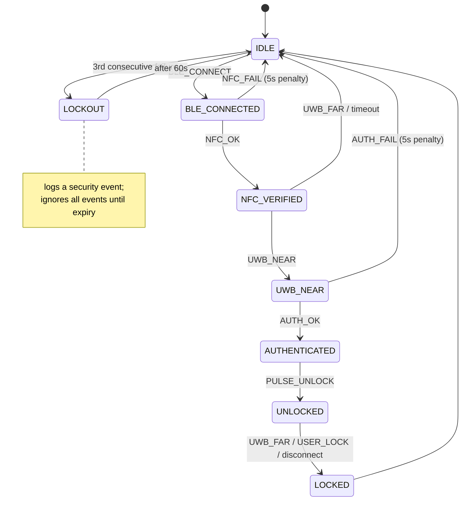
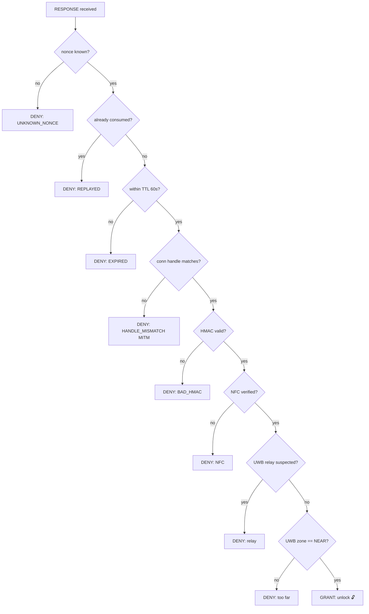
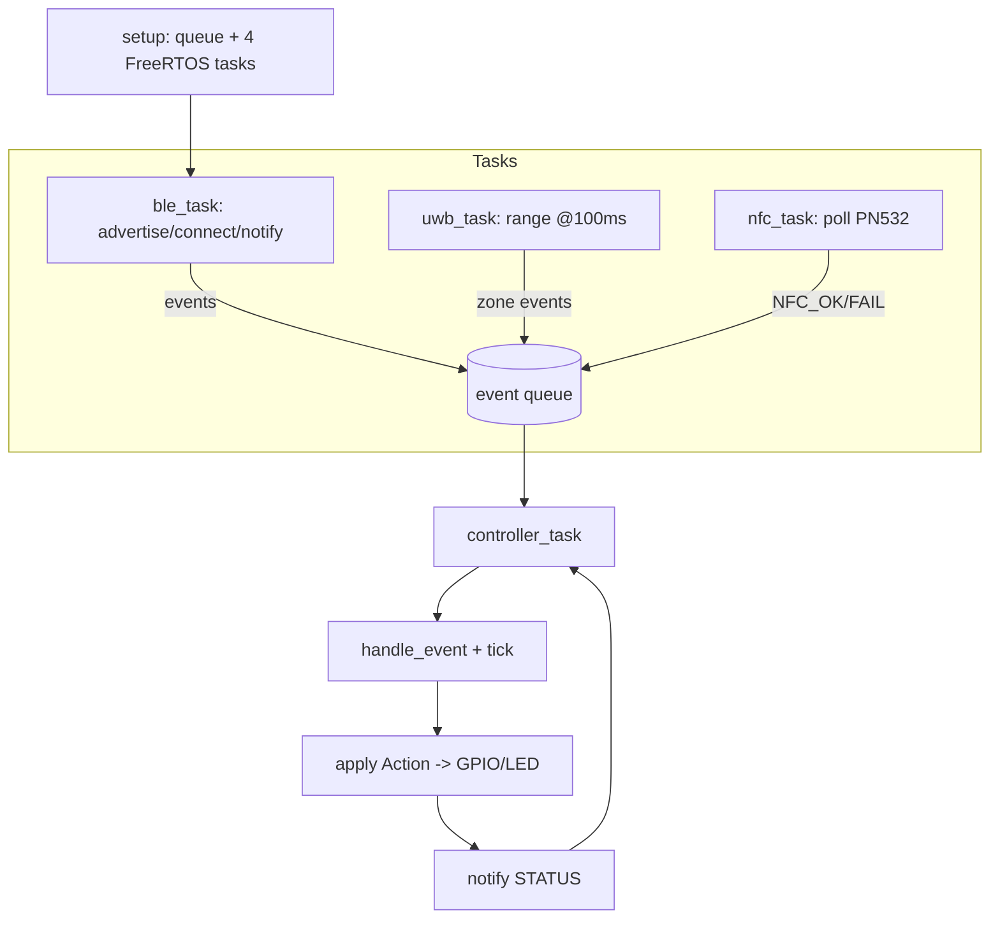
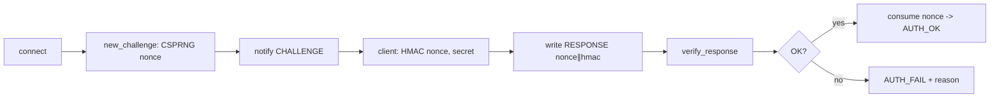
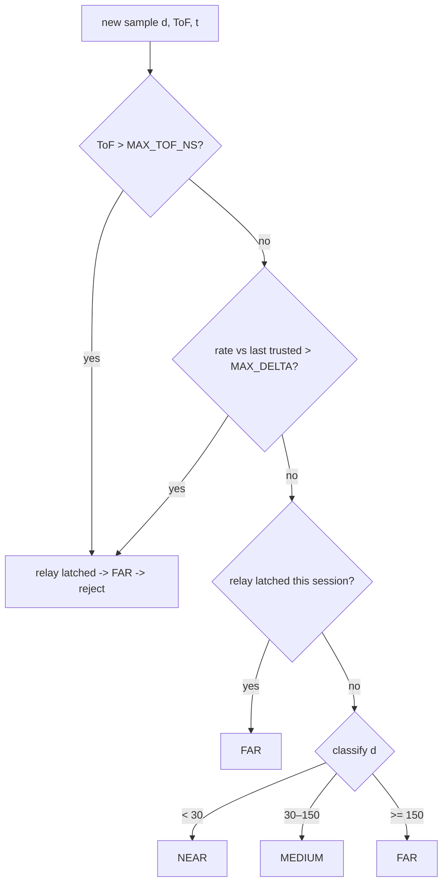

# SCA — Smart Car Access Smart Key Prototype

> Author: **Nguyen Dang Anh Tai** ([@anhtai2222](https://github.com/anhtai2222))

A complete, **fully simulated** automotive **digital smart-key** prototype
targeting the **ESP32-S3**. It combines four sensing/authentication channels —
**BLE**, **UWB**, **NFC**, and an **HMAC-SHA256 challenge-response** — behind a
hardened access **state machine**, and demonstrates that two classic keyless-
entry attacks (**relay** and **replay**) are *blocked* by design.

The firmware logic is **C++17** (PlatformIO / Arduino-ESP32 + NimBLE + mbedTLS);
the phone side and the whole end-to-end flow are simulated in **Python**. The
simulation, the attack demos, and **all tests run on a plain desktop with no
hardware** — the hardware-independent firmware logic is even compiled and
unit-tested on the host with GoogleTest.

```
sca_smartkey/
├── firmware/                         # ESP32-S3 C/C++ firmware (PlatformIO)
│   ├── platformio.ini
│   ├── src/
│   │   ├── main.cpp                  # FreeRTOS tasks + event-queue IPC
│   │   ├── ble_manager.{h,cpp}       # NimBLE GATT server, advertising, MTU, 30s timeout
│   │   ├── uwb_manager.{h,cpp}       # DW3000 abstraction + ranging + anti-relay
│   │   ├── nfc_manager.{h,cpp}       # PN532 reader + UID whitelist
│   │   ├── auth_engine.{h,cpp}       # HMAC-SHA256 challenge-response + nonce pool
│   │   ├── access_controller.{h,cpp} # State machine LOCKED <-> UNLOCKED
│   │   ├── gpio_actuator.{h,cpp}     # Relay / servo / RGB status LED (non-blocking)
│   │   └── config.h                  # ALL constants, keys, thresholds, pins
│   └── lib/
│       └── mbedtls_wrapper/          # Thin wrapper over mbedTLS HMAC (host fallback)
├── simulator/                        # Python desktop simulation
│   ├── sca_common.py                 # Shared crypto + server AuthEngine (mirrors FW)
│   ├── ble_sim.py                    # Virtual BLE GATT link
│   ├── uwb_sim.py                    # UWB ranging + relay detection
│   ├── nfc_sim.py                    # NFC tap simulation
│   ├── phone_sim.py                  # Phone (BLE+UWB+NFC client / digital key)
│   ├── vehicle_sim.py                # Vehicle-side server + access decision
│   ├── attack_sim.py                 # Relay + replay attack demos
│   └── full_demo.py                  # End-to-end: tap -> auth -> unlock
├── tests/
│   ├── test_auth.cpp                 # GoogleTest: HMAC engine (+ RFC 4231 KAT)
│   ├── test_state_machine.cpp        # GoogleTest: access FSM + UWB
│   ├── test_python_auth.py           # pytest: Python auth/UWB/attacks
│   └── CMakeLists.txt                # Host build for the C++ tests
├── docs/sequence_diagrams/           # PlantUML (auth_flow, relay_attack)
├── requirements.txt
└── README.md
```

---

# Theory & Background

## 1. BLE (Bluetooth Low Energy) Architecture

**GATT (Generic Attribute Profile)** defines a client/server model over the
Attribute Protocol. The vehicle is the **GATT server** (peripheral); the phone
is the **GATT client** (central).

- **Hierarchy:** a **Service** groups related **Characteristics**; each
  characteristic has a value and optional **Descriptors** (e.g. the Client
  Characteristic Configuration Descriptor, CCCD, that enables notifications).
- **This project's service** (`SCA-SmartKey`, UUID `6e9f0001-…`) exposes:
  | Characteristic | UUID suffix | Property | Purpose |
  |----------------|-------------|----------|---------|
  | CHALLENGE | `…0002` | **Notify** | server pushes the 32-byte nonce |
  | RESPONSE  | `…0003` | **Write (enc)** | client writes `nonce ∥ hmac` (64 B) |
  | STATUS    | `…0004` | **Notify** | server pushes the access-state byte |
- **Advertising vs connection:** before a link exists the peripheral
  **advertises** (broadcasts its name + service UUID); the central scans, then
  **connects**, after which data flows over the connection. After a disconnect
  the firmware re-advertises automatically.
- **MTU negotiation:** the default ATT MTU is 23 bytes (20 B payload). Because
  our RESPONSE is 64 bytes, the client negotiates a larger MTU (247) so the
  write fits in a single PDU.
- **Security:** production keyless entry uses **LE Secure Connections** (ECDH
  P-256 key agreement) with **MITM-protected pairing/bonding**. The firmware
  enables `setSecurityAuth(bonding, mitm, sc)` and marks RESPONSE as
  write-with-encryption; the application-layer HMAC challenge-response adds a
  second, transport-independent factor.

## 2. UWB (Ultra-Wideband) Ranging

UWB measures **distance by time-of-flight (ToF)** of sub-nanosecond pulses,
giving **~10 cm accuracy** — unlike BLE RSSI, which only infers a fuzzy,
easily-spoofed signal strength.

### Two-Way Ranging (TWR)

Single-sided TWR cancels clock offset using a round trip:

```
Initiator                         Responder
   |----------- poll ------------->|     t1 (resp RX)
   |                               |     (processing = T_reply)
   |<---------- response ----------|     t2 (resp TX)
 T_round = (t_resp_rx - t_poll_tx) at the initiator
 T_reply = (t_resp_tx - t_poll_rx) at the responder

           T_round - T_reply
   ToF  =  ─────────────────
                   2

   d = c · ToF = c · (T_round − T_reply) / 2
```

with `c ≈ 29.98 cm/ns`. Implemented as `UwbManager::twr_distance_cm()` /
`twr_distance_cm()` in Python.

### Proximity zones

| Zone   | Distance        | Action       |
|--------|-----------------|--------------|
| NEAR   | `< 30 cm`       | auto-unlock  |
| MEDIUM | `30 – 150 cm`   | arm          |
| FAR    | `≥ 150 cm`      | lock         |

### Why UWB defeats relay attacks

A relay forwards radio between a far phone and the car. It **cannot beat physics**:
forwarding adds latency that **inflates the measured ToF**, and the apparent
distance **teleports** between samples. Two plausibility checks catch this and
**latch** suspicion for the session: (1) `ToF > UWB_MAX_TOF_NS`, (2) distance
changes faster than `UWB_MAX_DELTA_CM_PER_S`.

### BLE RSSI vs UWB ranging

| Property            | BLE RSSI                 | UWB ToF ranging         |
|---------------------|--------------------------|-------------------------|
| Distance accuracy   | ±2–5 m (very coarse)     | ~10 cm                  |
| Physical principle  | signal strength          | time-of-flight          |
| Relay resistance    | poor (amplify signal)    | strong (latency caught) |
| Spoofability        | easy (vary TX power)     | hard (timestamped)      |
| Used by             | proximity hints only     | CCC Digital Key Phase 3 |

## 3. NFC Authentication

NFC here is the **intentional "tap"** factor (presence + a second channel).

- **ISO 14443 Type A/B** defines the RF + anti-collision + transport layers for
  proximity cards at 13.56 MHz. The PN532 reads the tag's **UID** during
  anti-collision (Type A `SELECT`).
- **NDEF** (NFC Data Exchange Format) is a TLV record format for carrying
  typed payloads (URIs, MIME, custom) on a tag or from a phone in card-emulation
  mode.
- **UID-based vs challenge-response:** UID whitelisting (used here for the PoC)
  is simple but UIDs are **clonable**, so it must never be the sole factor — it
  gates progress, while the cryptographic strength comes from the BLE HMAC
  challenge-response. Production systems run a **challenge-response over NFC**
  (e.g. DESFire/AES) instead of trusting the bare UID.

## 4. HMAC-SHA256 Challenge-Response

**HMAC** keys a hash so only holders of the secret can produce a valid tag:

```
HMAC(K, m) = H( (K ⊕ opad) ∥ H( (K ⊕ ipad) ∥ m ) )
```

with `ipad = 0x36…`, `opad = 0x5c…`, `H = SHA-256`, and `K` zero-padded (or
hashed if longer than the 64-byte block). Verified by the host build against
**RFC 4231 Test Case 2** and cross-checked between C++ and Python.

**Protocol:**
1. On connect the server generates a 32-byte CSPRNG **nonce** and sends it via
   CHALLENGE.
2. The client returns `HMAC-SHA256(nonce, shared_secret)` via RESPONSE.
3. The server recomputes with **mbedTLS `mbedtls_md_hmac()`** and compares in
   **constant time**.

**Why a nonce prevents replay:** the challenge is fresh and random every
session, so a captured response is worthless next time. This design adds three
more bindings: the nonce is **single-use** (consumed on success → `REPLAYED`),
has a **60 s TTL** (→ `EXPIRED`), and is **bound to the BLE connection handle**
(→ `HANDLE_MISMATCH`, an anti-MITM measure).

**Key management:** the PoC ships a hardcoded `SHARED_SECRET` in `config.h`
(flagged with `#warning "Replace … before production"`). Production must
provision per-device keys in a **secure element / HSM** (ESP32-S3 eFuse + Secure
Boot + Flash Encryption, or an external SE) and never store them in plaintext.

## 5. Relay Attack & MITM

- **Passive Keyless Entry (PKE) relay:** attackers place one device near the
  owner's key and another near the car, **relaying** the low-power exchange over
  a long-range link so the car believes the key is adjacent. Pure RSSI/BLE
  proximity is defeated by simply amplifying/forwarding the signal.
- **UWB timestamp binding defeats relay:** the round-trip is *timed*. Relay
  latency inflates ToF and the apparent distance jumps non-physically; both are
  rejected and suspicion **latches** (`uwb_manager` / `uwb_sim`).
- **Nonce TTL + single-use defeat replay:** a sniffed `nonce ∥ hmac` cannot be
  reused — the nonce is consumed and/or expired.
- **MITM + connection-handle binding:** a man-in-the-middle that relays a
  challenge to the real phone and forwards the answer over a *different*
  connection fails the `HANDLE_MISMATCH` check, because the nonce was issued
  bound to the original `conn_handle`.

## 6. CCC Digital Key Standard (overview)

The **Car Connectivity Consortium (CCC) Digital Key** is the industry standard
for phone-as-car-key. Lifecycle:

- **Owner pairing:** the owner device and vehicle establish a cryptographic
  trust relationship (mutual auth, key provisioning).
- **Digital key sharing:** the owner delegates time-/scope-limited keys to
  friends/family, brokered by the OEM/wallet servers.
- **Vehicle transaction:** day-to-day unlock/start using the provisioned keys.

**Phases:** Phase 1/2 — **NFC** passive entry (tap); Phase 2 — **BLE** + secure
element; **Phase 3** — **BLE + UWB** for hands-free, relay-resistant passive
entry. **This project aligns with CCC DK Phase 1 (NFC tap)** as the baseline,
and *demonstrates the Phase 3 UWB ranging concept* on top — a teaching prototype
of the standard's trajectory, not a certified implementation.

---

# Architecture Diagrams

## System architecture (ASCII)

```
                         ┌──────────────────────────────────────────┐
                         │            ESP32-S3 (firmware)            │
   ┌─────────┐  BLE      │  ┌─────────┐   events   ┌──────────────┐  │
   │  Phone  │◄─────────►│  │ BLE mgr │──────────► │  Access      │  │
   │ (digital│  UWB      │  ├─────────┤  (queue)   │  Controller  │  │
   │  key)   │◄─────────►│  │ UWB mgr │──────────► │  (FSM)       │  │
   │         │  NFC tap  │  ├─────────┤            └──────┬───────┘  │
   │         │──────────►│  │ NFC mgr │──────────►        │          │
   └─────────┘           │  ├─────────┴───────┐          ▼          │
                         │  │   AuthEngine     │   ┌──────────────┐  │
                         │  │ (HMAC + nonces)  │   │ GPIO actuator│  │
                         │  └────────┬─────────┘   │ relay/servo/ │  │
                         │           │ mbedTLS     │ RGB LED      │  │
                         │           ▼             └──────┬───────┘  │
                         │     HMAC-SHA256                │          │
                         └────────────────────────────────┼─────────┘
                                                           ▼
                                                    🔓 door lock
```

## BLE GATT service map

```
Service  SCA-SmartKey  (6e9f0001-b5a3-4f6d-9c21-7d3e8a1b2c40)
│
├── Characteristic CHALLENGE (…0002)  [NOTIFY]   value: nonce[32]
│      └── CCCD (enable notifications)
├── Characteristic RESPONSE  (…0003)  [WRITE/ENC] value: nonce[32] ∥ hmac[32]
└── Characteristic STATUS    (…0004)  [NOTIFY]   value: state[1] (0=ok/unlock,1=deny)
       └── CCCD
```

## Access state machine (Mermaid)



## Full authentication sequence (PlantUML)

See [`docs/sequence_diagrams/auth_flow.puml`](docs/sequence_diagrams/auth_flow.puml)
(render with the PlantUML extension or `plantuml`). Relay-attack mitigation is in
[`docs/sequence_diagrams/relay_attack.puml`](docs/sequence_diagrams/relay_attack.puml).

## Attack mitigation flowchart



---

# Flowcharts (Mermaid)

## Main firmware loop



## Auth engine flow



## UWB proximity decision tree



---

# Setup & Run

## Firmware (PlatformIO)

> Requires the real ESP32-S3 toolchain; not needed for the simulation/tests.

```bash
cd firmware
pio run                 # build for esp32-s3-devkitc-1
pio run -t upload       # flash
pio device monitor      # serial @115200
```

Wiring (defaults in `config.h`): relay `GPIO4`, servo `GPIO5`, RGB LED
`GPIO16/17/18`; PN532 over SPI/I2C; DW3000 over SPI.

## Python Simulator

No third-party packages are required to run the simulation (stdlib only):

```bash
cd sca_smartkey
python -m venv .venv && source .venv/bin/activate   # (Windows: .venv\Scripts\Activate.ps1)
pip install -r requirements.txt                     # only pytest, for the tests
```

## Run the full demo (no hardware)

```bash
cd simulator
python full_demo.py
```

Expected: BLE connect → NFC tap → UWB approach to NEAR → HMAC exchange →
**`RESULT: 🔓 UNLOCKED`** (exit code 0).

## Run the attack simulation

```bash
cd simulator
python attack_sim.py
```

Expected: **relay** attack blocked (UWB plausibility), **replay** attack
rejected (consumed/unknown nonce) → **`✅ ALL ATTACKS BLOCKED`** (exit code 0).

## Run tests

**Python** (auth, UWB, attacks, end-to-end):

```bash
python -m pytest tests/test_python_auth.py -q
```

**C++ firmware logic** (GoogleTest on the host, `-DSCA_HOST_BUILD`):

```bash
cmake -S tests -B build
cmake --build build -j
ctest --test-dir build --output-on-failure
# or run directly:
./build/sca_tests
```

These compile the hardware-independent firmware sources (`auth_engine`,
`access_controller`, `uwb_manager`, `nfc_manager`, `hmac_wrapper`) for the host
and verify HMAC correctness (incl. **RFC 4231** KAT), the anti-replay rules, and
the state machine — **all without an ESP32**.

> **Verified locally:** Python `17 passed`; C++ `23 tests PASSED`; `full_demo`
> and `attack_sim` both exit 0.

---

# Security Considerations & Future Work

**What this prototype does well**

- Defence-in-depth: NFC presence + UWB proximity + cryptographic
  challenge-response, all gated by a single decision point.
- Standards-grade crypto only (mbedTLS / Python `hmac`); constant-time compare;
  CSPRNG nonces; no homebrew primitives.
- Concrete, tested mitigations for **relay** and **replay**, plus an anti-MITM
  connection-handle binding and a 3-strike lockout with security logging.

**Known limitations (it is a teaching prototype, not a product)**

- **Hardcoded shared secret** in `config.h` — must be replaced with per-device
  keys in a secure element/HSM. (`#warning` enforces awareness at build time.)
- **NFC UID whitelist** is clonable; production needs an NFC challenge-response
  (DESFire/AES) and should not trust bare UIDs.
- **UWB is simulated** — real DW3000 ranging has noise, multipath and needs
  secure-ranging (STS) per IEEE 802.15.4z to prevent distance-reduction attacks.
- The PoC pairs without provisioned LE bonding keys; production must use **LE
  Secure Connections** with persisted bonds.

**Future work**

1. ESP32-S3 **Secure Boot v2 + Flash Encryption + eFuse**-stored keys.
2. Real **DW3000** driver + **IEEE 802.15.4z secure ranging (STS)**.
3. **NFC challenge-response** (DESFire EV2) replacing UID whitelist.
4. **CCC Digital Key** owner-pairing / key-sharing flows and OEM server hooks.
5. Hardware-in-the-loop CI: run the Python client (`bleak`) against a physical
   ESP32 over real BLE, reusing the identical characteristic contract.
6. Rate-limited, signed **security event log** persisted to RTC/NVS.

> ⚠️ This is an educational prototype. It is **not** safety- or security-certified
> and must not be used to secure a real vehicle.
```
